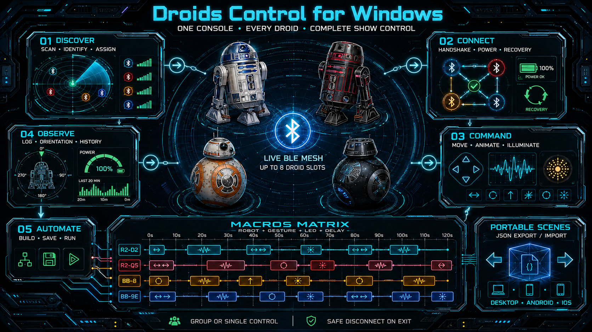
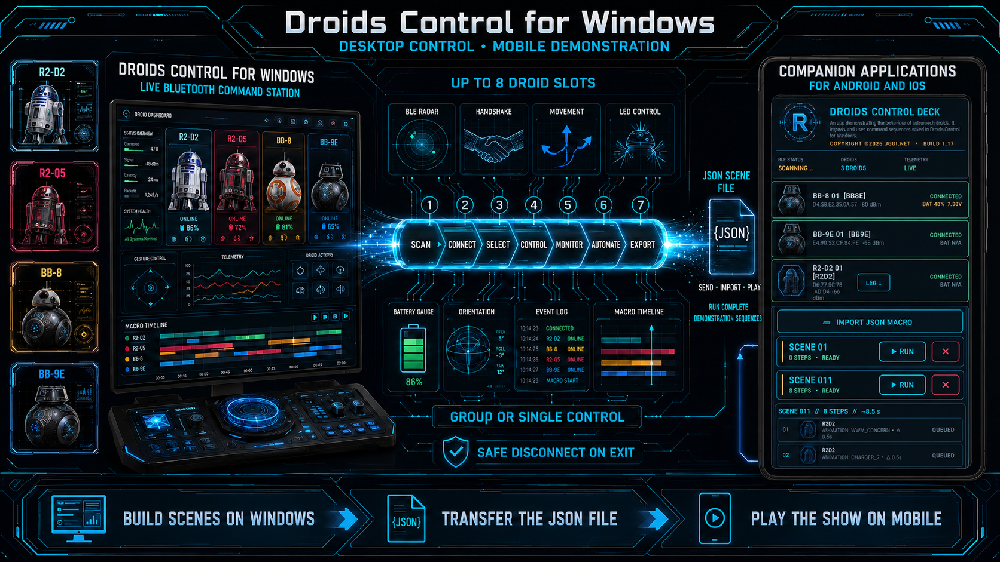
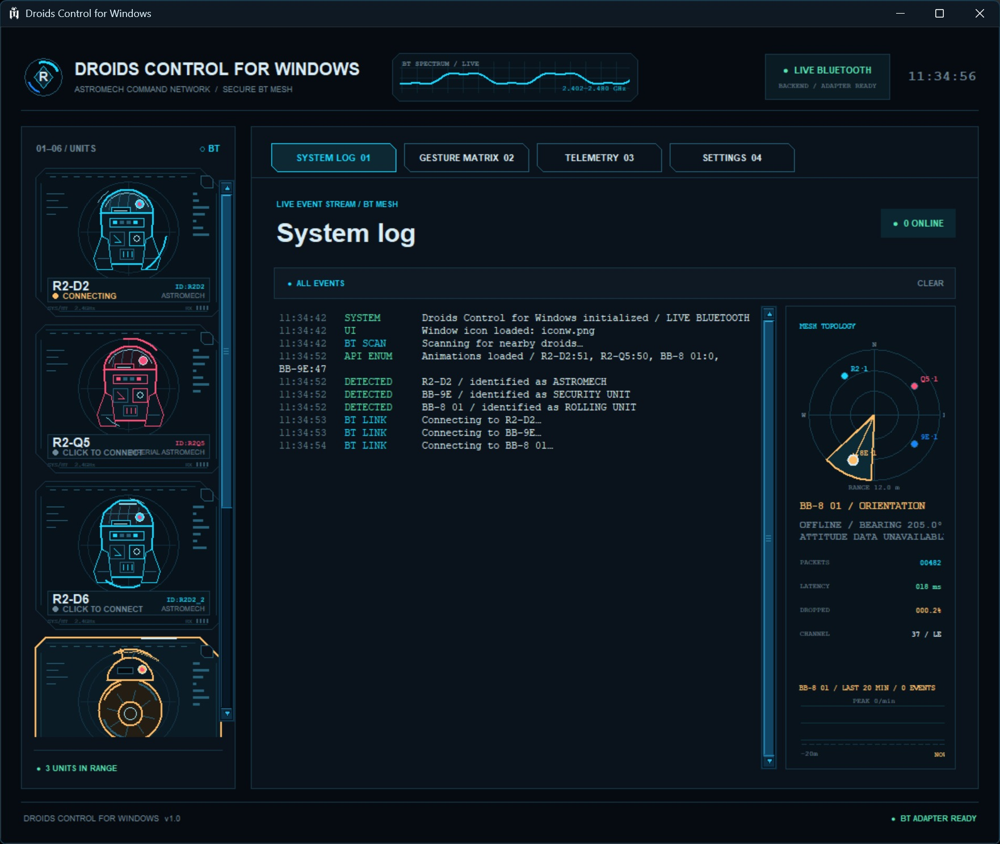
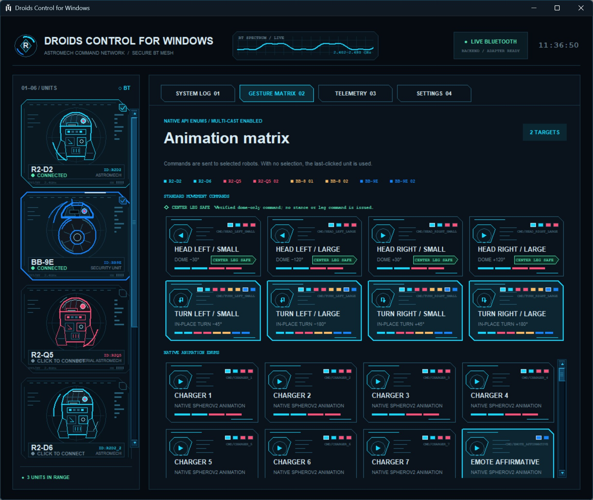
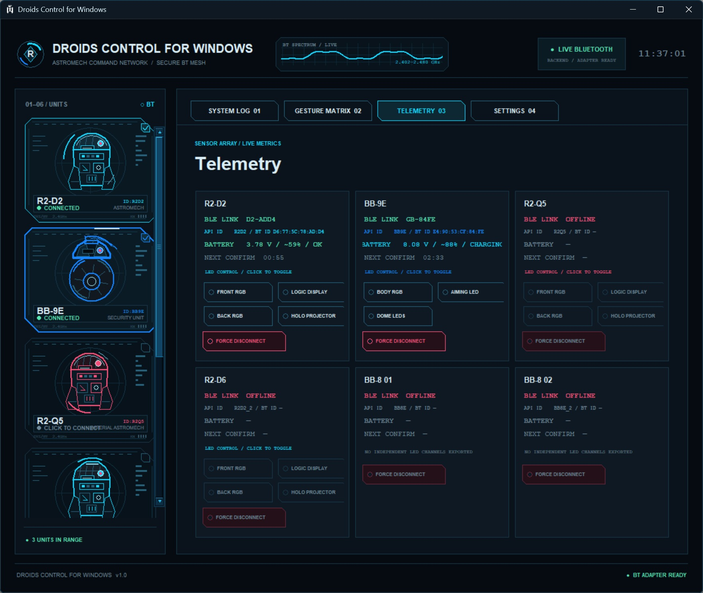
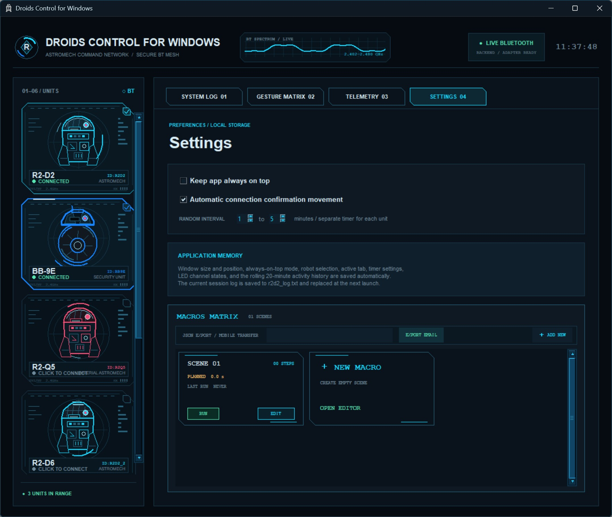

# Droids Control for Windows

Control Deck is a single-file Python desktop application for discovering, connecting to, monitoring, and controlling compatible Sphero Star Wars droids. If you do not know what are droids, see details below.

It provides a native animation discovery, telemetry, LED control, connection recovery, and reusable multi-robot macro scenes. The application can run directly from `r2d2_app.py` or be packaged as a standalone Windows executable.

> [!IMPORTANT]
> This is an unofficial privaate (open community) project. It is not affiliated with or endorsed by Sphero, Disney, Lucasfilm, or the Star Wars franchise. Product names and trademarks belong to their respective owners.





## Contents

- [Why this project exists](#why-this-project-exists)
- [Companion Android and iOS projects](#companion-android-and-ios-projects)
- [A short history of Sphero Star Wars droids](#a-short-history-of-sphero-star-wars-droids)
- [Finding a droid today](#finding-a-droid-today)
- [Features](#features)
- [Supported robots](#supported-robots)
- [Complete Windows installation](#complete-windows-installation)
- [Linux installation](#linux-installation)
- [macOS installation](#macos-installation)
- [Running Control Deck](#running-control-deck)
- [Building a standalone Windows EXE](#building-a-standalone-windows-exe)
- [Runtime files and macro transfer](#runtime-files-and-macro-transfer)
- [Troubleshooting](#troubleshooting)
- [Safety](#safety)

## Why this project exists

Sphero's licensed Star Wars droids combined unusually expressive physical hardware with Bluetooth control, lights, sound, sensors, and model-specific animations. The original mobile experience was built around a branded app and the movie-release cycle. Years later, the hardware can still be useful, but owners may encounter changing mobile-platform compatibility, unavailable legacy software, aging batteries, and limited control options.

Control Deck provides a desktop-oriented way to continue using compatible droids through their BLE interfaces. It is intended for collectors, demonstrations, synchronized displays, experimentation, and preservation of functional hardware. It does not replace official firmware, repair worn batteries, or guarantee compatibility with every operating-system and firmware combination.

The live backend uses the unofficial open-source [`spherov2`](https://pypi.org/project/spherov2/) Python library together with [`bleak`](https://pypi.org/project/bleak/) for Bluetooth Low Energy communication.

## Companion Android and iOS projects

Separate companion projects are also available for Android and iOS devices. They are designed as portable demonstration players rather than full replacements for the desktop Control Deck. Demonstration scenes are created and edited here in the desktop application, where commands for multiple robots can be arranged into complete sequences and saved as Control Deck JSON files. Send the resulting `r2d2_macro.json` file to the mobile device, import it into the Android or iOS companion application, and the device can run the entire prepared demonstration sequence without rebuilding the scene manually. This makes it possible to design and test complex shows on the desktop, then carry only a phone or tablet for the final presentation.

- [Control Deck for Android](https://github.com/JGUIMOBILEDEVELOPING/SPHERO-DROIDS-DEMO-ANDROID)
- [Control Deck for iOS](https://github.com/JGUIMOBILEDEVELOPING/SPHERO-DROIDS-DEMO-IOS)

## A short history of Sphero Star Wars droids

### Before Star Wars

Sphero began with app-controlled rolling robots. Its spherical drive platform, internal stabilization, wireless control, LEDs, and rechargeable battery technology made it a natural match for a physical version of BB-8.

The connection with Disney grew out of the 2014 Disney Accelerator program. During that relationship, Disney showed Sphero the then-secret rolling droid being developed for *Star Wars: The Force Awakens* and asked whether the company could turn the character into a consumer robot. Sphero's existing ball-robot technology provided the foundation, while a magnetic head mechanism created the recognizable BB-8 silhouette. The development story is described in [Wired's history of the Sphero BB-8 project](https://www.wired.com/2015/09/bb8-the-inside-story/).

### 2015 — BB-8

Sphero's app-enabled BB-8 was released on September 4, 2015, as part of the first Force Friday merchandise launch for *The Force Awakens*. It was controlled by an iOS or Android application over Bluetooth and included driving, autonomous patrol behavior, character sounds through the mobile device, and an augmented-reality “holographic message” experience.

BB-8 became one of the most visible connected toys associated with the film. It demonstrated how a licensed character could be more than a static collectible: the robot could move around a room, respond to commands, and receive new behaviors through software.

### 2016 — Force Band and extended BB-8 play

Sphero expanded the line with the Force Band, a wrist-worn controller that allowed gesture-based driving, and a battle-worn BB-8 edition. The band was an attempt to make interaction more physical and reduce dependence on holding a phone during play. It later became part of Sphero's legacy-product list together with the droids.

### 2017 — R2-D2 and BB-9E

For Force Friday II and the merchandise campaign around *Star Wars: The Last Jedi*, Sphero introduced R2-D2 and BB-9E. Contemporary coverage reported that both went on sale at the beginning of September 2017. See [Engadget's launch coverage](https://www.engadget.com/2017-08-31-sphero-r2-d2-bb-9e.html).

R2-D2 used a different mechanical format from the rolling-ball products. It included articulated side legs, a retractable center leg, a rotating dome, integrated speaker, functional lights, and animation sequences. It could transition between two-legged and three-legged stances, drive, turn, react, and reproduce familiar character motion.

BB-9E reused Sphero's rolling-droid expertise in a darker First Order design. Its magnetic head, body lighting, dome lighting, and firmware animations differed from BB-8 even though both shared the general rolling-unit concept.

### Late 2017 — R2-Q5

R2-Q5 followed as a limited, dark Imperial astromech derived from the R2-D2 hardware platform. It was announced in October 2017 and sold as a Best Buy exclusive, with wider availability scheduled for November 2017. Contemporary launch information described a US price of $199.99 and intentionally limited distribution. See [the R2-Q5 launch report](https://www.macrumors.com/2017/10/05/sphero-r2-q5-iphone-star-wars/) and the archived [Best Buy product information](https://www.bestbuy.com/site/sphero-r2-q5-black/5863602.p?skuId=5863602).

R2-Q5 shared much of R2-D2's control architecture while using Imperial colors, lighting, sound, and character presentation. Its smaller production and retailer exclusivity helped make it one of the more difficult models to find later.

### 2018 — the licensed line ends

In December 2018, Sphero confirmed that it was ending production of licensed Disney products, including its Star Wars droids. Remaining inventory was to be sold, but new units would no longer be manufactured. Reporting at the time attributed the decision to the resources required by licensed products and to sales that declined sharply after the first year of a film-related launch. Sphero's educational robots had a longer commercial life and became a more sustainable strategic focus. See [TechCrunch's report on Sphero's shift](https://techcrunch.com/2018/12/18/sphero-is-finished-making-star-wars-products/) and [Engadget's discontinuation report](https://www.engadget.com/2018-12-18-sphero-discontinues-bb-8.html).

This did not mean that every robot immediately stopped working. The physical droids use local Bluetooth communication, and compatible software can still communicate with functioning hardware. However, discontinued manufacturing, aging batteries, evolving phone operating systems, and the lifecycle of the original consumer apps made long-term ownership more complicated.

### Current legacy status

Sphero now categorizes BB-8, R2-D2, BB-9E, R2-Q5, and the Force Band as legacy products. Its official legacy page states that BB-8 and R2-D2 are no longer manufactured or sold by Sphero. The native Sphero Edu applications still list BB-8, BB-9E, R2-D2, and R2-Q5 as supported BLE robots, although the browser-based Sphero Edu web app does not support all of them. See [Sphero's legacy-products page](https://sphero.com/pages/legacy-products) and [Sphero's current BLE connection guide](https://help.sphero.com/sphero-support/troubleshooting-connection-with-sphero-edu).

Control Deck communicates locally and does not depend on the original Droids by Sphero consumer application. It still depends on the computer's Bluetooth stack, the Python BLE libraries, the robot firmware, and the physical condition of the robot.

## Finding a droid today

New retail stock is no longer produced. Units may still appear through private auctions, collector marketplaces, used-electronics shops, local classified listings, estate sales, or unopened old stock. Availability and price vary significantly by model, condition, included accessories, and region. R2-Q5 is commonly harder to find because of its limited retailer-exclusive release.

Before buying a used unit, ask the seller to demonstrate:

- successful power-on and charging;
- Bluetooth discovery and connection;
- physical movement in both directions;
- head or dome movement where applicable;
- working speaker and LEDs;
- the R2 center-leg mechanism;
- the condition of BB-8 or BB-9E's magnetic head;
- battery runtime after a full charge;
- inclusion of the correct charging cradle, cable, and removable head.

BB-8 and BB-9E normally wake and charge on their charging bases. R2-D2 and R2-Q5 use a micro-USB connection. A robot listed as “untested” should be treated as a repair-risk purchase, not as proof that only the battery is empty.

Lithium batteries deteriorate with age even when a collectible is unused. Do not charge or operate a device with swelling, cracking, unusual heat, leakage, chemical odor, or visible impact damage. Battery replacement can require disassembly and is outside the scope of this project.

## Features

- Automatic BLE discovery and connection.
- Support for up to two instances of each recognized robot model.
- Individual and group command targeting.
- Native animation catalog loaded from each robot API.
- Standard dome and in-place turn controls.
- Live connection, battery, orientation, and activity telemetry where supported.
- Per-channel LED controls for supported models.
- Connection health monitoring, detailed diagnostics, and manual reconnect/disconnect controls.
- Random per-robot connection-confirmation movements with configurable intervals.
- Macros Matrix with reusable scenes, editable steps, LED actions, delays, execution state, JSON import, and JSON export.
- Persistent window geometry, user selections, settings, macro scenes, and rolling activity history.
- A simulation mode for interface testing without physical robots.
- Graceful shutdown that stops queued work before closing BLE sessions.

## Supported robots

| Model family | Display slots | Native animations | Dome control | Independent LEDs |
| --- | --- | ---: | ---: | ---: |
| R2-D2 | R2-D2, R2-D6 | Yes | Yes | Yes |
| R2-Q5 | R2-Q5, R2-Q5 02 | Yes | Yes | Yes |
| BB-8 | BB-8 01, BB-8 02 | Not exported by `spherov2` | No | No |
| BB-9E | BB-9E, BB-9E 02 | Yes | No | Yes |

The second slot permits two physical robots from the same model family to connect simultaneously. `R2-D6` is the Control Deck display name for a second detected R2-D2 slot; it does not claim that Sphero manufactured a separate R2-D6 product.

Availability of individual commands, animations, battery data, and sensors depends on the robot model, firmware, operating system, Bluetooth adapter, and the underlying library.

## Repository files

| Path | Purpose |
| --- | --- |
| `r2d2_app.py` | Complete Control Deck source application |
| `iconw.png` | Runtime window icon |
| `requirements.txt` | Pinned Python package versions |
| `README.md` | Project history, installation, usage, and build guide |
| `LICENSE` | MIT license text |
| `CHANGELOG.md` | Release history |
| `docs/screenshots/` | GitHub screenshots |

## Complete Windows installation

The tested and recommended source environment is 64-bit Python 3.11 on 64-bit Windows 10 or Windows 11. Use the same Python environment for installing packages and launching the application.

### 1. Prepare Windows and the robots

1. Enable Bluetooth in **Settings → Bluetooth & devices**.
2. Install the current driver for the computer's internal Bluetooth adapter or USB BLE adapter.
3. Close Sphero Edu, Droids by Sphero, phone apps, and any other program that may already own the robot connection.
4. Charge the robots before the first test.
5. Keep them close to the computer during discovery.

Traditional manual pairing in Windows Settings is normally unnecessary because Control Deck discovers the droids as BLE devices.

### 2. Install Python 3.11

Download a 64-bit Python 3.11 installer from [python.org](https://www.python.org/downloads/). During installation:

- enable **Add python.exe to PATH**;
- keep **pip** selected;
- keep **tcl/tk and IDLE** selected because Control Deck uses Tkinter;
- install the Python launcher when offered.

Open a new PowerShell window and verify the installation:

```powershell
py -3.11 --version
py -3.11 -m pip --version
```

### 3. Download or clone Control Deck

With Git installed:

```powershell
git clone https://github.com/YOUR-USERNAME/control-deck.git
cd control-deck
```

Without Git, download the repository ZIP from GitHub, extract it, and open PowerShell inside the extracted directory. In File Explorer, right-click the folder background and choose **Open in Terminal**, or use:

```powershell
cd "C:\path\to\control-deck"
```

Verify that the required files are present:

```powershell
Get-ChildItem r2d2_app.py, requirements.txt, iconw.png
```

### 4. Create an isolated virtual environment

```powershell
py -3.11 -m venv .venv
```

Activate it:

```powershell
.\.venv\Scripts\Activate.ps1
```

If PowerShell blocks script activation, allow it only for the current PowerShell process and try again:

```powershell
Set-ExecutionPolicy -Scope Process -ExecutionPolicy Bypass
.\.venv\Scripts\Activate.ps1
```

The prompt should now begin with `(.venv)`.

### 5. Install every required Python component

Upgrade packaging tools first:

```powershell
python -m pip install --upgrade pip setuptools wheel
```

Install the pinned Control Deck requirements and all of their dependencies:

```powershell
python -m pip install -r requirements.txt
```

Do not add `--no-deps`. On Windows with Python 3.11, Bleak requires `bleak-winrt`; pip installs it automatically when dependency resolution is enabled. `spherov2` also requires packages such as `numpy` and `transforms3d`.

If a previous offline installation omitted dependencies, repair it with:

```powershell
python -m pip install --upgrade --force-reinstall -r requirements.txt
```

If the application specifically reports `No module named 'bleak_winrt'` under Python 3.11, install the missing Windows backend explicitly:

```powershell
python -m pip install "bleak-winrt>=1.2.0,<2.0.0"
```

### 6. Verify the environment

```powershell
python -c "import tkinter; import bleak; import bleak_winrt; import spherov2; import numpy; import transforms3d; print('Control Deck environment OK')"
```

Then compile-check the source:

```powershell
python -m py_compile r2d2_app.py
```

### 7. Test simulation mode

Simulation mode confirms that the interface, icon, settings, and macro system start without requiring physical robots:

```powershell
python r2d2_app.py --simulate
```

Close the simulation normally before starting live mode.

### 8. Start live Bluetooth mode

```powershell
python r2d2_app.py
```

Wait for a green `handshake OK` log entry before sending commands. The first scan can take several seconds for each model and Windows may need additional time to release a BLE device after another application disconnects.

### Starting the application later

Each time you open a new PowerShell window:

```powershell
cd "C:\path\to\control-deck"
.\.venv\Scripts\Activate.ps1
python r2d2_app.py
```

Deactivate the environment when finished:

```powershell
deactivate
```

## Linux installation

BLE behavior and permissions vary between distributions. On Debian or Ubuntu, install Python, Tkinter, the virtual-environment module, and BlueZ:

```bash
sudo apt update
sudo apt install python3 python3-venv python3-tk bluez
sudo systemctl enable --now bluetooth
```

Clone or extract the repository, then run:

```bash
cd control-deck
python3 -m venv .venv
source .venv/bin/activate
python -m pip install --upgrade pip setuptools wheel
python -m pip install -r requirements.txt
python -m py_compile r2d2_app.py
python r2d2_app.py --simulate
python r2d2_app.py
```

Your desktop session and user account must be allowed to access the system Bluetooth service. If discovery fails, verify that `bluetooth.service` is running and that no other application is connected to the robot.

## macOS installation

Install a complete Python distribution that includes Tkinter. A current installer from [python.org](https://www.python.org/downloads/macos/) is the simplest option.

From Terminal in the repository directory:

```bash
python3 -m venv .venv
source .venv/bin/activate
python -m pip install --upgrade pip setuptools wheel
python -m pip install -r requirements.txt
python -m py_compile r2d2_app.py
python r2d2_app.py --simulate
python r2d2_app.py
```

The first live scan may trigger a macOS Bluetooth permission request for Python or Terminal. Grant access under **System Settings → Privacy & Security → Bluetooth**.

## Running Control Deck

Start live Bluetooth mode:

```bash
python r2d2_app.py
```

Start simulation mode without robots:

```bash
python r2d2_app.py --simulate
```

For the most reliable BLE session:

1. Close other applications connected to the robots.
2. Charge and wake the robots.
3. Keep them close during the first scan.
4. Wait for a green `handshake OK` entry.
5. Use **Force Disconnect** if a session becomes stale, then click the robot tile to reconnect.

## Building a standalone Windows EXE

PyInstaller can bundle the Python interpreter, Tkinter, Control Deck, and installed Python packages. The target computer does not need Python or pip. Build the Windows executable on Windows; PyInstaller output is specific to the operating system, architecture, and Python environment used for the build. See the official [PyInstaller operating-mode documentation](https://pyinstaller.org/en/stable/operating-mode.html).

Python 3.11 is recommended for this build because the pinned Bleak version uses the `bleak-winrt` backend in that environment.

### 1. Create a clean build environment

Open PowerShell in the repository directory:

```powershell
py -3.11 -m venv .venv-build
.\.venv-build\Scripts\Activate.ps1
python -m pip install --upgrade pip setuptools wheel
python -m pip install -r requirements.txt
python -m pip install pyinstaller==6.21.0 pillow
```

Verify the build environment:

```powershell
python -c "import tkinter; import bleak; import bleak_winrt; import spherov2; print('Build environment OK')"
python -m py_compile r2d2_app.py
```

### 2. Create a multi-resolution Windows icon

PyInstaller uses an ICO file for the executable icon. Convert the supplied PNG with Pillow:

```powershell
python -c "from PIL import Image; Image.open('iconw.png').save('iconw.ico', sizes=[(16,16),(32,32),(48,48),(64,64),(128,128),(256,256)])"
```

### 3. Build an onedir test version

Build a folder-based package first because missing imports and DLLs are easier to diagnose:

```powershell
pyinstaller --noconfirm --clean --windowed --onedir `
  --name "Control Deck" `
  --icon "iconw.ico" `
  --add-data "iconw.png:." `
  --collect-all spherov2 `
  --collect-all bleak `
  --collect-all bleak_winrt `
  --collect-all transforms3d `
  r2d2_app.py
```

Run:

```powershell
& ".\dist\Control Deck\Control Deck.exe"
```

For `--onedir`, distribute the entire `dist\Control Deck` directory. The EXE depends on the accompanying `_internal` directory.

### 4. Build the final onefile version

After the onedir build passes simulation and live BLE tests:

```powershell
pyinstaller --noconfirm --clean --windowed --onefile `
  --name "Control Deck" `
  --icon "iconw.ico" `
  --add-data "iconw.png:." `
  --collect-all spherov2 `
  --collect-all bleak `
  --collect-all bleak_winrt `
  --collect-all transforms3d `
  r2d2_app.py
```

The standalone file is created at:

```text
dist\Control Deck.exe
```

Run it from PowerShell for the first test:

```powershell
& ".\dist\Control Deck.exe"
```

### 5. Understand onefile runtime behavior

A PyInstaller one-file executable extracts bundled program components into a temporary `_MEI...` directory on every launch. This is normal. Control Deck does not store user macros or logs there. In frozen mode it uses `sys.executable` to place these persistent files next to the actual EXE:

```text
Control Deck.exe
r2d2_macro.json
r2d2_log.txt
```

Keep the portable EXE in a user-writable directory such as `C:\Control Deck`, Documents, or a dedicated portable-app folder. Do not place it under `Program Files` unless you redesign the data paths or install it with appropriate permissions. PyInstaller documents the difference between the executable path and its temporary bundle directory in [Runtime Information](https://pyinstaller.org/en/stable/runtime-information.html).

### 6. Test on another computer

Use a Windows computer without Python installed, or Windows Sandbox:

1. Copy `Control Deck.exe` and `iconw.png` into a writable folder. The PNG is bundled, but keeping it beside the EXE also allows easy replacement and is harmless.
2. Enable Bluetooth.
3. Start the EXE and test `--simulate` only with a separate console build, or test the normal GUI startup.
4. Verify that `r2d2_log.txt` is created beside the EXE.
5. Create a small macro, restart the EXE, and verify that `r2d2_macro.json` persists.
6. Test live discovery and one command per robot before testing group commands or long macros.
7. Confirm that **Show JSON File** highlights the persistent JSON file.

The receiving computer does not need Python, pip, `spherov2`, Bleak, or PyInstaller because those components are bundled.

### 7. SmartScreen and code signing

An unsigned executable downloaded from the internet may trigger Microsoft Defender SmartScreen. This does not automatically mean the file is malicious; it means the executable has no established publisher reputation. For public distribution, consider signing releases with an Authenticode code-signing certificate and publish SHA-256 hashes for downloadable binaries.

## Runtime files and macro transfer

Control Deck creates these files automatically:

| File | Location | Purpose |
| --- | --- | --- |
| `.r2d2_control_deck.json` | User home directory | Window geometry and user settings |
| `r2d2_macro.json` | Next to `r2d2_app.py` or the packaged EXE | Saved macro scenes and mobile transfer |
| `r2d2_log.txt` | Next to `r2d2_app.py` or the packaged EXE | Current session log; overwritten on the next launch |

These generated files are excluded from Git by default.

The **Show JSON File** button saves all macro scenes and opens the system file explorer. On Windows, `r2d2_macro.json` is highlighted and ready to be dragged directly into a Gmail message in Chrome.

The **Import JSON** button validates a selected Control Deck macro file and reports malformed data. After confirmation, a valid import replaces the currently saved collection of scenes. Keep backups before importing an untested file.

Control Deck does not request or store email addresses or mail credentials.

## Screenshots










## Troubleshooting

### `No module named 'bleak_winrt'`

This indicates an incomplete Windows BLE installation, commonly caused by installing backup wheels with `--no-deps`:

```powershell
python -m pip install "bleak-winrt>=1.2.0,<2.0.0"
```

Or rebuild the environment with normal dependency resolution:

```powershell
python -m pip install --upgrade --force-reinstall -r requirements.txt
```

### No robots are detected

- Verify that Bluetooth is enabled and the robot is awake.
- Close other applications that may own the BLE connection.
- Move the robot closer to the adapter.
- Verify that the correct virtual environment is active.
- Click its tile to force a fresh scan and connection attempt.

### A robot is connected but does not move

- Wait for `handshake OK` before sending commands.
- Check the System Log for `BT STALE`, `TimeoutError`, or firmware acknowledgement errors.
- Use **Force Disconnect**, wait for the offline state, then click the tile to reconnect.
- Check the reported battery voltage and charge the robot if necessary.
- Confirm that the command is supported by that model.

### Tkinter is missing

On Debian or Ubuntu:

```bash
sudo apt install python3-tk
```

On Windows, rerun the Python installer, choose **Modify**, and install **tcl/tk and IDLE**.

### PowerShell cannot activate the virtual environment

```powershell
Set-ExecutionPolicy -Scope Process -ExecutionPolicy Bypass
.\.venv\Scripts\Activate.ps1
```

This changes policy only for the current PowerShell process.

### The GUI EXE closes without an error message

Build a temporary diagnostic version without `--windowed`:

```powershell
pyinstaller --noconfirm --clean --onefile --name "Control Deck Debug" `
  --icon "iconw.ico" `
  --add-data "iconw.png:." `
  --collect-all spherov2 `
  --collect-all bleak `
  --collect-all bleak_winrt `
  --collect-all transforms3d `
  r2d2_app.py
```

Run the resulting EXE from PowerShell and read the console traceback.

## Safety

Robots may move immediately after connecting or when a macro runs. Place them on a clear, stable surface away from stairs, edges, liquids, pets, and people. Test new macro scenes with one robot at a time and remain nearby while physical robots are active.

Do not operate a robot with a swollen, leaking, unusually hot, or visibly damaged battery. Do not leave aging lithium batteries charging unattended.

## Development notes

The complete application is intentionally kept in one Python file. Hardware access is isolated behind backend classes so interface work can be tested with `--simulate` without changing live BLE behavior.

Before opening a pull request:

```bash
python -m py_compile r2d2_app.py
python r2d2_app.py --simulate
```

When changing frozen-application paths, remember that `__file__` points inside the PyInstaller bundle while `sys.executable` points to the launched EXE.

## Historical and technical references

- [Sphero legacy products](https://sphero.com/pages/legacy-products)
- [Sphero Edu BLE troubleshooting and supported legacy robots](https://help.sphero.com/sphero-support/troubleshooting-connection-with-sphero-edu)
- [The story and technology behind Sphero BB-8 — Wired](https://www.wired.com/2015/09/bb8-the-inside-story/)
- [R2-D2 and BB-9E Force Friday II launch — Engadget](https://www.engadget.com/2017-08-31-sphero-r2-d2-bb-9e.html)
- [R2-Q5 launch and availability](https://www.macrumors.com/2017/10/05/sphero-r2-q5-iphone-star-wars/)
- [Sphero ends licensed Star Wars production — TechCrunch](https://techcrunch.com/2018/12/18/sphero-is-finished-making-star-wars-products/)
- [`spherov2` 0.12.1 on PyPI](https://pypi.org/project/spherov2/0.12.1/)
- [Bleak 0.22.3 on PyPI](https://pypi.org/project/bleak/0.22.3/)
- [PyInstaller operating modes](https://pyinstaller.org/en/stable/operating-mode.html)
- [PyInstaller runtime information](https://pyinstaller.org/en/stable/runtime-information.html)

## License

Released under the [MIT License](LICENSE).
